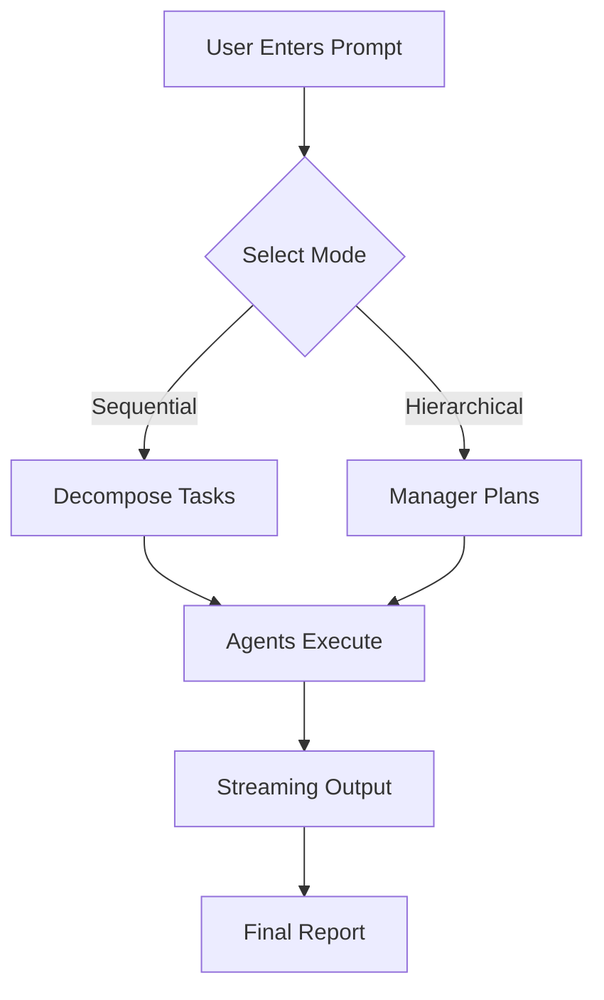
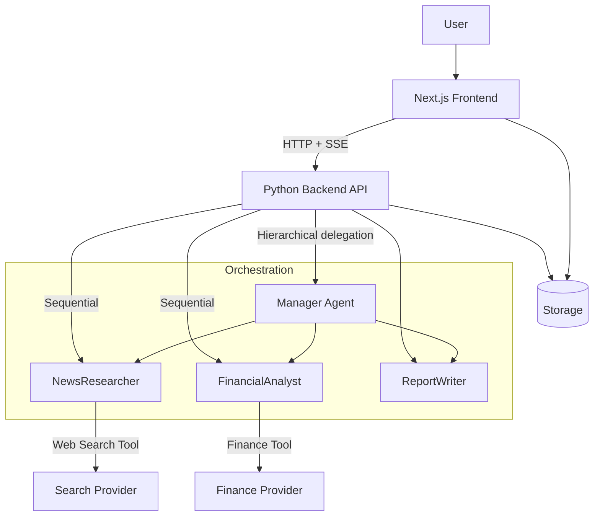

# Multi-Agent System Web Platform


A professional, full-featured **multi-agent system web platform** split into two folders:

- `frontend/` — **Next.js** (App Router) with **TypeScript**, **Tailwind CSS**, and **shadcn/ui** for a modern, polished UI.
- `backend/` — **Python** service implementing a **CrewAI-style multi-agent workflow** (specialized agents + tasks + tools), optimized for fast response and clear orchestration.

This document is the authoritative project spec (tasks, architecture, UX, APIs, file structure, and implementation plan).

---

## 📑 Table of Contents

1. [Project Goal](#-1-project-goal)
2. [Required Learning Module Mapping](#-2-required-learning-module-mapping)
3. [Product Requirements](#-3-product-requirements)
4. [Architecture Overview](#-4-architecture-overview)
5. [Backend (Python) Design](#-5-backend-python-design)
6. [Frontend (Next.js) Design](#-6-frontend-nextjs-design)
7. [Performance and Optimization](#-7-performance-and-optimization)
8. [Security and Reliability](#-8-security-and-reliability)
9. [Suggested File Structure](#-9-suggested-file-structure)
10. [Implementation Checklist](#-10-implementation-checklist)
11. [Definition of Done](#-11-definition-of-done)

---

## 🎯 1) Project Goal

Build a web app where a user can:

1.  Enter a **single prompt** (e.g., Generate a market report about Competitor X).
2.  The system **automatically decomposes** the prompt into smaller tasks.
3.  Tasks are routed to **three specialized agents**:
    *   `NewsResearcher`
    *   `FinancialAnalyst`
    *   `ReportWriter`
4.  The agents collaborate to produce a **final polished report** displayed in the UI.
5.  Optionally add a **Manager agent** to coordinate work in a hierarchical workflow.

> 💡 **Context:** This directly implements **Module 5: The A-Team — Collaborative Multi-Agent Systems** (Lab: The Automated Market Research Team).

---

## 📚 2) Required Learning Module Mapping

### 5.1 Theory: The Power of Specialization (CrewAI)

> ⚠️ **Problem:** One "super agent" fails because it mixes incompatible goals, loses track of outputs, and becomes unreliable.

**Solution: Divide and Conquer**

| Concept | Definition |
| :--- | :--- |
| **Agent** | Role + Goal + Backstory + Tools |
| **Task** | Assignment for an agent |
| **Tool** | Functions agent can call (web search, finance API) |
| **Process** | Sequential (assembly line) or Hierarchical (manager-worker) |

### 5.2 Hands-on Lab: Automated Market Research Team

The platform generates a **market report** on "Competitor X" by combining:
*   Latest news / product launches
*   Stock performance and financial summary
*   Synthesized memo

### 5.3 Guided Coding Activity: Building the Crew

| Agent | Role | Tool | Task |
| :--- | :--- | :--- | :--- |
| **NewsResearcher** | Researcher | Web search (Tavily/Serper) | Find latest news, press releases, launches. |
| **FinancialAnalyst** | Analyst | Financial data (Alpha Vantage) | Analyze stock performance and financial summary. |
| **ReportWriter** | Writer | None | Produce final business memo. |

### 5.4 Lab Expansion: Adding a Manager

Switch from sequential to hierarchical:
*   `Manager` agent coordinates and validates outputs.
*   Delegates to `NewsResearcher` and `FinancialAnalyst`.
*   Requests clarification when needed.

---

## 📋 3) Product Requirements

### 3.1 Core User Flows



1.  **New Research Session**: User enters prompt and selects process type.
2.  **Task Decomposition**: System generates a plan; UI shows live checklist.
3.  **Agent Execution**: User sees progress; outputs appear in real-time.
4.  **Final Report**: Business memo with sections, sources, and export options.

### 3.2 UX Requirements (Professional Web App)

*   **Layout**: Modern dashboard (Sidebar, Chat, Timeline).
*   **Chatbot Design**: Unique "Message bubbles", avatars, collapsible evidence.
*   **Performance**: Fast load, streaming responses, caching.
*   **Accessibility**: Keyboard nav, contrast.

---

## 🏗️ 4) Architecture Overview

### 4.1 High-level Diagram



### 4.2 Folder Split

| Folder | Contents | Rationale |
| :--- | :--- | :--- |
| `frontend/` | UI, API proxy routes | Modern stack, polished UI |
| `backend/` | Python orchestration, tools, API | Clear separation, independent scaling |

---

## 🐍 5) Backend (Python) Design

### 5.1 Tech Choices

*   **Framework**: FastAPI (async, production-friendly)
*   **Streaming**: SSE (Server-Sent Events)
*   **Validation**: Pydantic
*   **Tasks**: Celery/RQ (Optional/Future)

### 5.2 Agent Model

Each agent possesses: `name`, `role`, `goal`, `backstory`, and `tools`.

| Agent | Description |
| :--- | :--- |
| **NewsResearcher** | Uses search tool to find information. |
| **FinancialAnalyst** | Uses finance tool to analyze market data. |
| **ReportWriter** | Synthesizes findings into a report. |
| **Manager** | Validates and delegates tasks. |

### 5.3 Tools

| Tool | Provider | Output Structure |
| :--- | :--- | :--- |
| **Web Search** | Tavily/Serper (or Mock) | `title`, `snippet`, `url`, `published_at` |
| **Finance** | Alpha Vantage (or Mock) | `symbol`, `price`, `history`, `metrics` |

### 5.4 Orchestration Processes

<details>
<summary>Click to view Process Logic</summary>

#### Sequential
1.  Decompose prompt into tasks.
2.  Run `NewsResearcher` and `FinancialAnalyst`.
3.  Pass results into `ReportWriter`.
4.  Stream events to frontend.

#### Hierarchical
1.  Manager interprets prompt, creates/assigns tasks.
2.  Manager requests results from `NewsResearcher` and `FinancialAnalyst`.
3.  Manager verifies sufficiency.
4.  Manager asks `ReportWriter` to finalize.

</details>

### 5.5 API Endpoints

| Method | Endpoint | Description |
| :--- | :--- | :--- |
| `POST` | `/api/sessions` | Create session |
| `GET` | `/api/sessions/{id}` | Fetch session state |
| `POST` | `/api/sessions/{id}/run` | Start run |
| `GET` | `/api/sessions/{id}/events` | SSE stream of agent events |

### 5.6 Data Storage

> 💡 **Recommendation:** Use **SQLite** for persistence and queryable history.

---

## ⚛️ 6) Frontend (Next.js) Design

### 6.1 Tech Choices

*   **Framework**: Next.js App Router
*   **Language**: TypeScript
*   **Styling**: Tailwind CSS
*   **Components**: shadcn/ui
*   **State**: React Query / SWR
*   **Streaming**: EventSource (SSE)

### 6.2 Key Screens

1.  `/` — Landing / New session
2.  `/chat` — Main chat + agents panel
3.  `/sessions/[id]` — Session replay

### 6.3 UI Components

*   `ChatComposer`: Prompt input + run button
*   `AgentTimeline`: Shows agents + status
*   `TaskBoard`: Tasks checklist
*   `ReportViewer`: Final memo with sources

---

## 🚀 7) Performance and Optimization

### Backend
*   Async IO for tool calls.
*   Timeouts + retries for external APIs.
*   Caching by query hash.

### Frontend
*   Minimal re-renders.
*   Streaming updates chunked.
*   Memoized components.

---

## 🔒 8) Security and Reliability

> 🛡️ **Security Checklist:**
> *   API keys stored in `.env` (never committed).
> *   Basic rate limiting.
> *   Sanitize URLs and outputs.
> *   Robust error events to UI.

---

## 📂 9) Suggested File Structure

```text
/
├── frontend/
│   ├── app/
│   ├── components/
│   ├── lib/
│   └── styles/
└── backend/
    ├── app/
    │   ├── main.py
    │   ├── agents/
    │   ├── tools/
    │   ├── orchestration/
    │   └── models/
    └── tests/
```

---

## ✅ 10) Implementation Checklist

- [ ] **Repo Setup**: Next.js + Tailwind + shadcn/ui.
- [ ] **Backend Setup**: FastAPI + SSE + Agent Classes.
- [ ] **Tool Integrations**: Search + Finance (Real + Mock).
- [ ] **UI Implementation**: Chat + Timeline + Report Viewer.
- [ ] **QA**: Unit tests + Manual validation.

---

## 🏁 11) Definition of Done

*   Fully usable web platform with polished UI.
*   Prompt is decomposed into tasks and routed to agents.
*   Supports sequential and hierarchical process modes.
*   Produces a professional market report with sources.
*   Frontend and backend run locally with clear instructions.
