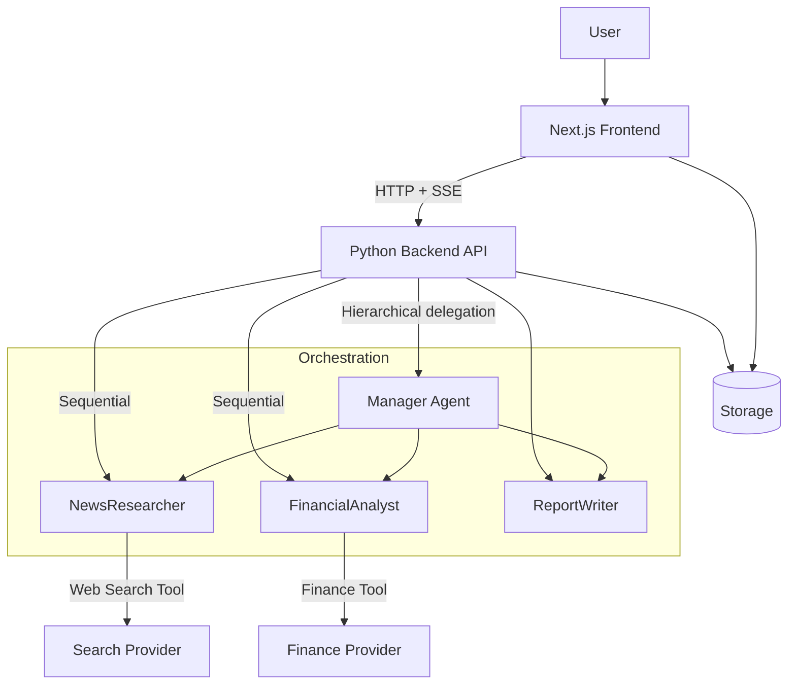

# Multi-Agent System Web Platform

A professional, full-featured **multi-agent system web platform** split into two folders:

- `frontend/` — **Next.js** (App Router) with **TypeScript**, **Tailwind CSS**, and **shadcn/ui** for a modern, polished UI.
- `backend/` — **Python** service implementing a **CrewAI-style multi-agent workflow** (specialized agents + tasks + tools), optimized for fast response and clear orchestration.

This document is the authoritative project spec (tasks, architecture, UX, APIs, file structure, and implementation plan).

---

## 1) Project Goal

Build a web app where a user can:

1. Enter a **single prompt** (e.g., Generate a market report about Competitor X).
2. The system **automatically decomposes** the prompt into smaller tasks.
3. Tasks are routed to **three specialized agents**:
   - `NewsResearcher`
   - `FinancialAnalyst`
   - `ReportWriter`
4. The agents collaborate to produce a **final polished report** displayed in the UI.
5. Optionally add a **Manager agent** to coordinate work in a hierarchical workflow.

This directly implements:

- **Module 5: The A-Team — Collaborative Multi-Agent Systems**
- Lab: **The Automated Market Research Team**
- Expansion: **Adding a Manager** (Sequential → Hierarchical)

---

## 2) Required Learning Module Mapping (what the platform demonstrates)

### 5.1 Theory: The Power of Specialization (CrewAI)

**Key idea**: One “super agent” fails because:

- It mixes incompatible goals (research + analysis + writing).
- It loses track of intermediate outputs.
- It becomes less reliable as tasks grow.

**Divide and conquer**:

- Split the business process into distinct roles.
- Provide each agent with:
  - **Role** (who it is)
  - **Goal** (what success is)
  - **Backstory** (why it thinks/acts a certain way)

**Conceptual model**:

- **Agent**: role + goal + backstory + tools.
- **Task**: assignment for an agent.
- **Tool**: functions agent can call (web search, finance API).
- **Process**:
  - Sequential: assembly line.
  - Hierarchical: manager-worker.

### 5.2 Hands-on Lab: Automated Market Research Team

The platform generates a **market report** on “Competitor X” by combining:

- latest news / product launches
- stock performance and financial summary
- synthesized memo

This mimics a real business process (competitive analysis) that normally takes days.

### 5.3 Guided Coding Activity: Building the Crew

Agents defined:

1) **NewsResearcher**
- Tool: Web search (Tavily/Serper or mock).
- Task: latest news, press releases, launches.

2) **FinancialAnalyst**
- Tool: Financial data (Alpha Vantage or mock).
- Task: stock performance and financial summary.

3) **ReportWriter**
- Tools: None.
- Task: produce final business memo.

### 5.4 Lab Expansion: Adding a Manager

Switch from sequential to hierarchical:

- `Manager` agent coordinates and validates outputs
- delegates to `NewsResearcher` and `FinancialAnalyst`
- requests clarification when needed

---

## 3) Product Requirements

### 3.1 Core User Flows

1. **New Research Session**
   - User enters prompt and selects process type:
     - Sequential (default)
     - Hierarchical (with Manager)

2. **Task Decomposition**
   - System generates a plan: small tasks assigned to agents.
   - UI shows tasks as a live checklist.

3. **Agent Execution and Streaming Output**
   - User sees each agent’s progress (thinking steps hidden; results shown).
   - Outputs appear in real-time, with citations/links when available.

4. **Final Report**
   - Rendered as:
     - Business memo with sections
     - Sources list
     - Option to export as Markdown/PDF

### 3.2 UX Requirements (Professional Web App)

- Modern dashboard layout with:
  - left sidebar: sessions history
  - main area: chatbot + results
  - right panel: agents and tasks timeline

- **Unique chatbot design**
  - “Message bubbles” per agent
  - agent avatars + role labels
  - collapsible “evidence” blocks for sources

- Performance:
  - fast first load
  - streaming responses
  - caching of repeated calls

- Accessibility:
  - keyboard navigation
  - sufficient contrast

---

## 4) Architecture Overview

### 4.1 High-level Diagram



### 4.2 Folder Split

- `frontend/` contains UI and API proxy routes (optional)
- `backend/` contains Python orchestration + tools + API

Rationale:

- clear separation of concerns
- independent scaling and deployment

---

## 5) Backend (Python) Design

### 5.1 Tech Choices

- Framework: **FastAPI** (async, fast, production-friendly)
- Streaming: **SSE** (Server-Sent Events) for incremental updates
- Validation: Pydantic
- Optional background tasks: Celery/RQ (future)

### 5.2 Agent Model

Each agent has:

- `name`
- `role`
- `goal`
- `backstory`
- `tools` (callable functions)

Agents:

- `NewsResearcher`: uses search tool.
- `FinancialAnalyst`: uses finance tool.
- `ReportWriter`: synthesizes.
- `Manager`: validates and delegates.

### 5.3 Tools

1) Web Search Tool
- Provider: Tavily/Serper
- Alternative: mock implementation for offline development

2) Finance Tool
- Provider: Alpha Vantage
- Alternative: mock API

Tool outputs should be structured:

- `title`
- `snippet`
- `url`
- `published_at`

### 5.4 Orchestration Processes

#### Sequential

1. Decompose prompt into tasks.
2. Run `NewsResearcher` and `FinancialAnalyst`.
3. Pass results into `ReportWriter`.
4. Stream events to frontend.

#### Hierarchical

1. Manager interprets prompt, creates/assigns tasks.
2. Manager requests results from `NewsResearcher` and `FinancialAnalyst`.
3. Manager verifies sufficiency.
4. Manager asks `ReportWriter` to finalize.

### 5.5 API Endpoints (Proposed)

- `POST /api/sessions` — create session
- `GET /api/sessions/{id}` — fetch session state
- `POST /api/sessions/{id}/run` — start run
- `GET /api/sessions/{id}/events` — SSE stream of agent events

Event types:

- `session_created`
- `task_planned`
- `agent_started`
- `agent_output`
- `agent_finished`
- `final_report`
- `error`

### 5.6 Data Storage

MVP options:

- file-based JSON store
- SQLite

Recommended:

- SQLite for persistence and queryable history

---

## 6) Frontend (Next.js) Design

### 6.1 Tech Choices

- Next.js App Router
- TypeScript
- Tailwind CSS
- shadcn/ui components
- State management: React Query or SWR for fetch + cache
- Streaming: EventSource (SSE)

### 6.2 Key Screens

1) `/` — Landing / New session
2) `/chat` — Main chat + agents panel
3) `/sessions/[id]` — Session replay

### 6.3 UI Components

- `ChatComposer` — prompt input + run button
- `AgentTimeline` — shows agents + status
- `TaskBoard` — tasks checklist
- `ReportViewer` — final memo with sources

### 6.4 Styling Guidelines

- clean typography
- consistent spacing
- dark mode support
- unique agent “bubbles”

---

## 7) Performance and Optimization

### Backend

- async IO for tool calls
- timeouts + retries for external APIs
- caching by query hash (news/finance)

### Frontend

- minimal re-renders
- streaming updates chunked
- memoized components

---

## 8) Security and Reliability

- API keys stored in `.env` (never committed)
- basic rate limiting
- sanitize URLs and outputs
- robust error events to UI

---

## 9) Suggested File Structure

```
frontend/
  app/
  components/
  lib/
  styles/
backend/
  app/
    main.py
    agents/
    tools/
    orchestration/
    models/
  tests/
```

---

## 10) Implementation Checklist (Engineering Tasks)

### Repo Setup

- Create `frontend/` Next.js app with TS
- Add Tailwind CSS
- Install and configure shadcn/ui

### Backend Setup

- Create `backend/` FastAPI app
- Add SSE streaming endpoint
- Implement agent classes + orchestration

### Tool Integrations

- Search tool provider + mock fallback
- Finance tool provider + mock fallback

### UI Implementation

- Chat UI + unique agent bubble design
- Task breakdown panel
- Live agent status timeline
- Final report viewer and export

### QA

- Basic unit tests for orchestration
- Manual UI validation

---

## 11) Definition of Done

- Fully usable web platform with polished UI
- Prompt is decomposed into tasks and routed to agents
- Supports sequential and hierarchical process modes
- Produces a professional market report with sources
- Frontend and backend run locally with clear instructions
